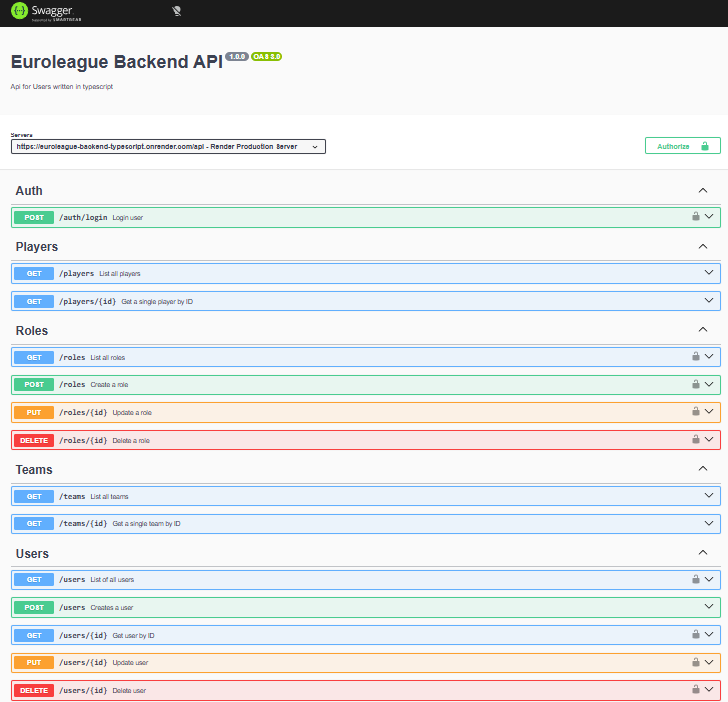
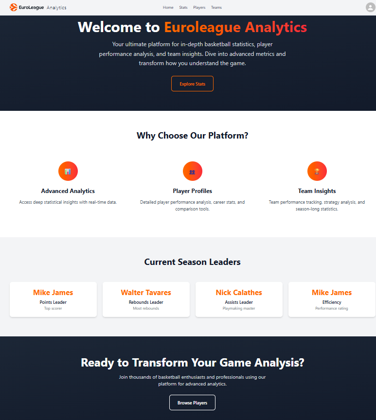
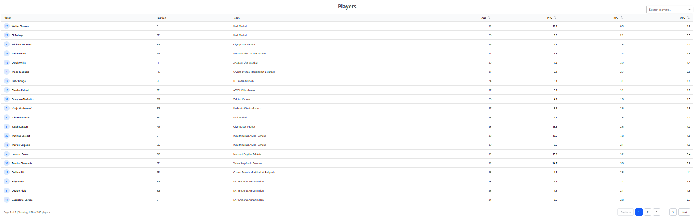
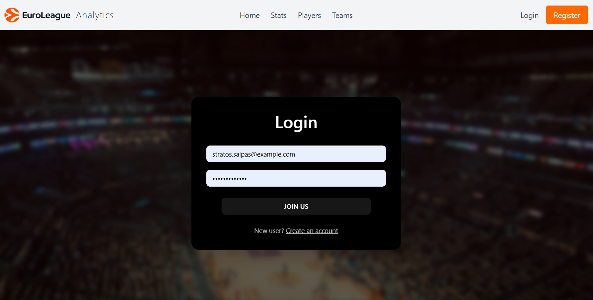
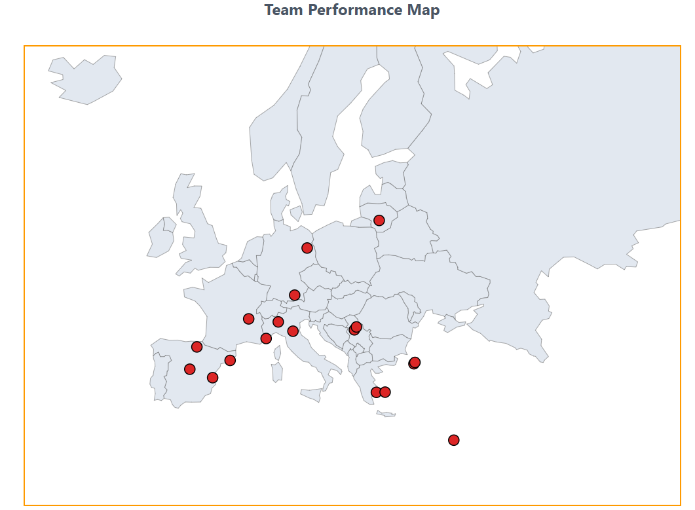
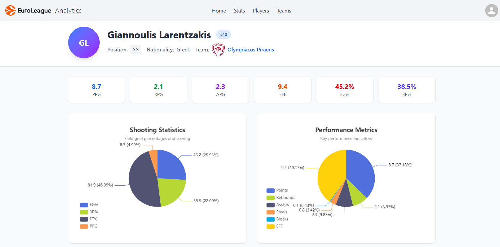
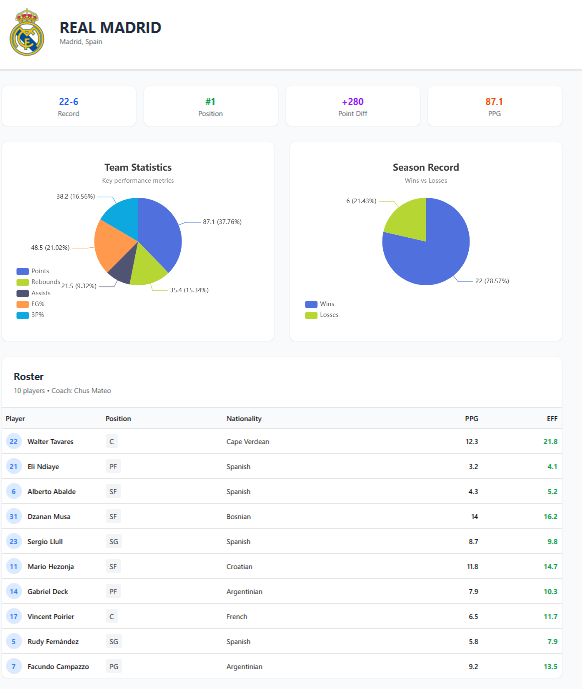
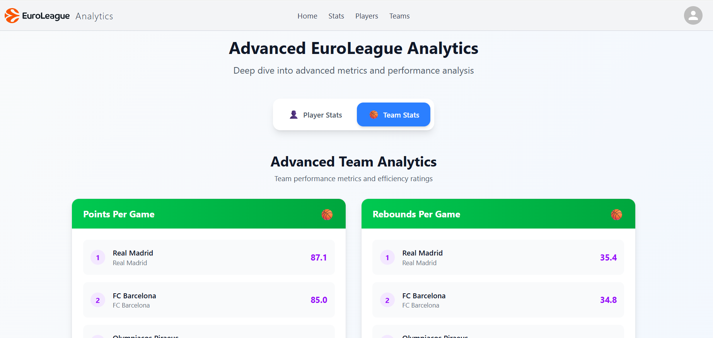
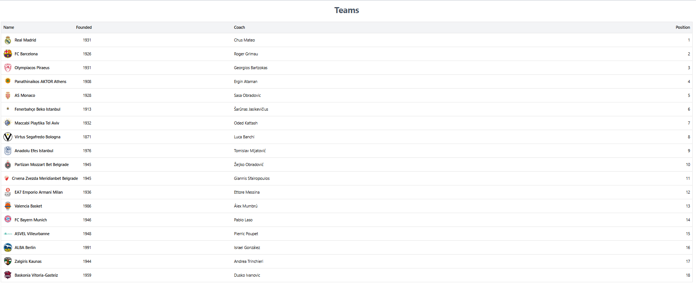

# 🏀 Frontend Euroleague Project

A responsive **React + TypeScript** application for Euroleague basketball fans.  
Built with **Vite**, **Tailwind CSS**, and **React Hook Form**, it allows users to register, log in, and view/update user data with a modern UI.

---

## 🌐 Live Demo

You can access the app online here:  
🔗 [https://frontend-euroleague.onrender.com](https://frontend-euroleague.onrender.com)

---

## 📸 Screenshots

### Swagger API


### Application Screenshots









---

## 📦 Features

- User registration with **form validation** (powered by **Zod** + **React Hook Form**)
- User login and navigation
- Select dropdowns for **country** and **favorite team**
- Responsive and visually appealing UI
- Integration with a backend API (CRUD operations for users)
- Error handling and toast notifications using **Sonner**

---

## 🚀 Technologies Used

- **Frontend:** React, TypeScript, Vite, Tailwind CSS
- **Forms & Validation:** React Hook Form, Zod
- **UI Components:** Custom Input, Button, Select components
- **Notifications:** Sonner
- **Backend API:** REST API for user management

---

## 🖥 Demo / Access

You can try the app without registering your own account. Use the demo credentials:

**Email:** `stratos.salpas@example.com`  
**Password:** `mypassword123`

This account allows you to explore all features.

⚠️ Important:  
To use the demo account, you must create a `.env` file in the root directory of the project with the following content:

```env
VITE_API_URL=https://euroleague-backend-typescript.onrender.com/api

---

## ⚡ Getting Started

### 1. Clone the repository

```bash
git clone https://github.com/stratossal/frontend_euroleague.git
cd frontend_euroleague
